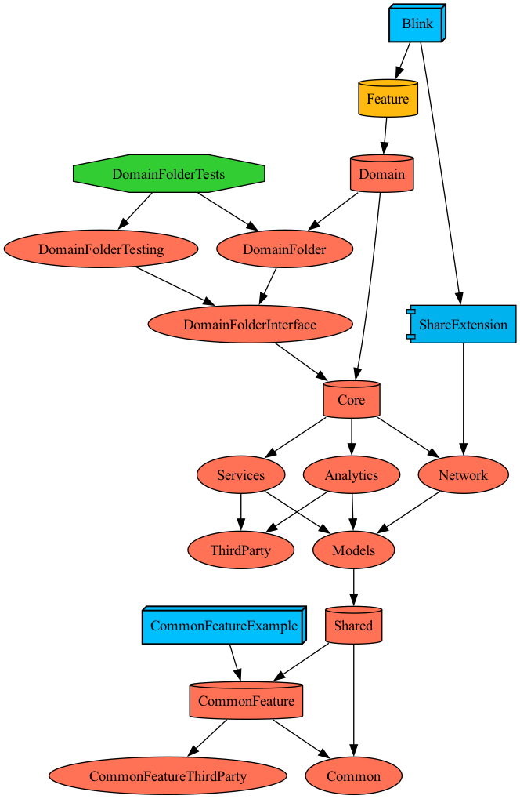

# Blink

### [📱 앱 설치하러 가기](https://apps.apple.com/kr/app/ai-%EB%A7%81%ED%81%AC-%EC%95%84%EC%B9%B4%EC%9D%B4%EB%B9%99-%EB%B8%94%EB%A7%81%ED%81%AC/id6605930254)

> AI 링크 아카이빙 서비스, **Blink**
> 
> 
> v1.0.0 **개발기간: 2023.06.25 ~ 2024.09.25**
> 
> **지속적인 업데이트**: 2024.09.25 ~ (진행중)

### 주요 기능
- AI 링크 요약 및 분류 폴더 추천
- 폴더 별 링크 아카이빙

# ⚙️ 개발환경 및 기술스택

- **Minimum Deployment**: iOS 16.2
- **Swift Version**: 6.0
- **Dependency Manager**: SPM (Tuist 통합)
- **Project Generator**: Tuist 4.113.1

### Architecture
`SwiftUI` · `TCA (The Composable Architecture) 1.23.1+` · `@Dependency 기반 DI` · `Swift Concurrency`

### Networking
`Moya 15.0.3+`

### Firebase
`Crashlytics` · `Analytics` · `Messaging (Push Notifications)`

### 3rd Party
`Kingfisher 8.6.2+` · `Lottie 4.5.2+` · `SwiftUI Introspect 26.0.0+` · `KakaoSDK 2.22.0` · `GoogleSignIn 9.0.0+` · `GoogleMobileAds 12.14.0+` · `FSCalendar 2.8.3+` · `FSPagerView 1.3.7+`

# 🧩 모듈 구조

Tuist 기반 멀티 모듈 구조로, **TCA 네이티브 구조 + `swift-dependencies` DI 라이브러리 기반 클라이언트 패턴**을 적용해 레이어별 책임과 의존성을 분리했습니다.

- **App** — 메인 앱 타겟 + ShareExtension 진입점
- **BKFeatures** — TCA 기반 화면(Feature) 레이어. 17개 Scene 포함
- **BKCore** — 비즈니스 로직 및 인프라. 네트워킹 코어(`NetworkCore`)와 `@DependencyClient` 기반 18개 Client 모듈(`Clients/`)로 구성
- **BKDesignSystem** — BK 프리픽스 디자인 시스템(BKTextField, BKBottomSheet 등) 및 리소스
- **BKShared** — 공용 확장·키체인·모델(`BKCommon`, `BKModel`)
